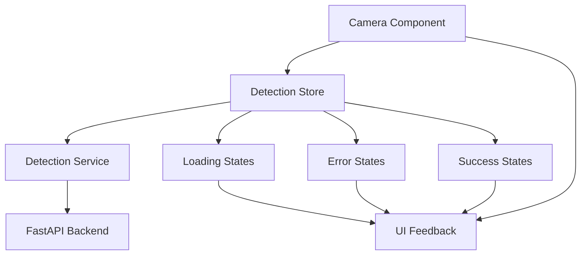

# Design Document

## Overview

The scan detection system follows a layered architecture with clear separation of concerns: the Camera Component handles UI and user interactions, the Detection Store manages state and orchestrates operations, and the Detection Service handles API communication. This design ensures maintainability, testability, and follows the established project patterns.

## Architecture



The architecture follows the established pattern:

- **Presentation Layer**: Camera Component (UI/UX)
- **State Management**: Detection Store (Zustand)
- **Service Layer**: Detection Service (API calls)
- **External**: FastAPI Detection Backend

## Components and Interfaces

### Detection Store Interface

```typescript
interface DetectionState {
  // Current state
  isDetecting: boolean;
  detections: Detection[];
  error: string | null;

  // Actions
  detect: (imageUri: string) => Promise<void>;
  clearError: () => void;
  clearDetections: () => void;
}

interface Detection {
  id: string;
  name: string;
  confidence: number;
  boundingBox?: BoundingBox;
  timestamp: string;
}

interface BoundingBox {
  x: number;
  y: number;
  width: number;
  height: number;
}
```

### Detection Service Interface

```typescript
interface DetectionServiceResponse {
  detections: DetectionResult[];
  processingTime: number;
  imageMetadata: ImageMetadata;
}

interface DetectionResult {
  class: string;
  confidence: number;
  bbox?: [number, number, number, number];
}

interface DetectionServiceConfig {
  minConfidence: number;
  clusteringDistance: number;
  timeout: number;
}
```

### Camera Component States

The component will manage these UI states:

- **Idle**: Ready to capture
- **Capturing**: Taking photo
- **Preview**: Showing captured image
- **Detecting**: Processing scan
- **Results**: Displaying detection results
- **Error**: Showing error message

## Data Models

### Enhanced Detection Model

```typescript
interface Detection {
  id: string;
  name: string;
  confidence: number;
  boundingBox?: BoundingBox;
  timestamp: string;
  imageUri?: string;
  processingTime?: number;
}
```

### Error Model

```typescript
interface DetectionError {
  type: "network" | "api" | "validation" | "timeout";
  message: string;
  code?: string;
  timestamp: string;
}
```

### Detection History Model

```typescript
interface DetectionHistory {
  sessions: DetectionSession[];
  maxSessions: number;
}

interface DetectionSession {
  id: string;
  imageUri: string;
  detections: Detection[];
  timestamp: string;
  status: "success" | "error" | "partial";
}
```

## Error Handling

### Error Categories

1. **Network Errors**

   - Connection timeout
   - No internet connectivity
   - Server unreachable

2. **API Errors**

   - Invalid response format
   - Server errors (5xx)
   - Authentication issues

3. **Validation Errors**

   - Invalid image format
   - File size limits
   - Missing required parameters

4. **Client Errors**
   - Camera permissions
   - File system access
   - Memory constraints

### Error Recovery Strategies

- **Automatic Retry**: For transient network issues (max 3 attempts)
- **User Retry**: For recoverable errors with user action
- **Graceful Degradation**: Fallback to cached results when possible
- **Clear Messaging**: User-friendly error descriptions with actionable steps

## Testing Strategy

### Unit Tests

- Detection Store state management
- Detection Service API calls and error handling
- Utility functions for data transformation

### Integration Tests

- Component-Store-Service interaction flow
- Error propagation through layers
- State synchronization

### E2E Tests

- Complete photo capture and detection flow
- Error scenarios and recovery
- Network connectivity edge cases

## Performance Considerations

### Image Optimization

- Compress images before upload (quality: 0.8)
- Resize large images to reasonable dimensions
- Use progressive JPEG format

### Memory Management

- Limit detection history to 10 recent sessions
- Clean up image URIs when sessions are removed
- Implement lazy loading for detection results

### Network Optimization

- Implement request timeout (30 seconds)
- Add request cancellation for component unmount
- Use exponential backoff for retries

## Security Considerations

### Data Privacy

- Images are processed locally and via API only
- No persistent storage of sensitive image data
- Clear temporary files after processing

### API Security

- Validate all API responses
- Sanitize user inputs
- Implement rate limiting awareness

## Implementation Phases

### Phase 1: Core Detection Flow

- Enhanced store with loading/error states
- Improved service with proper error handling
- Basic UI feedback in camera component

### Phase 2: Advanced Features

- Detection result visualization
- History management
- Performance optimizations

### Phase 3: Polish & Testing

- Comprehensive error scenarios
- Loading state improvements
- Performance monitoring
