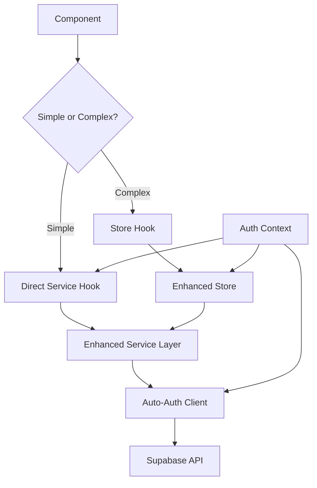

# Design Document

## Overview

The current architecture has multiple conflicting patterns for handling authentication and API calls:

1. **Hook Pattern**: `useSessions` uses `getAuthenticatedClient()` directly - clean and simple
2. **Service + Store Pattern**: `sessionsStore` calls services that require manual token passing - complex and error-prone
3. **Mixed Usage**: Some components use hooks, others use stores, creating inconsistency

This design consolidates these patterns into a unified, simplified approach that eliminates manual token passing while maintaining flexibility for different use cases.

## Architecture

### Core Principles

1. **Automatic Authentication**: Services should never require manual token passing
2. **Pattern Consistency**: One clear pattern for each use case (simple vs complex state management)
3. **Developer Experience**: Minimal boilerplate, maximum clarity
4. **Backward Compatibility**: Gradual migration path from existing patterns

### Component Architecture



## Components and Interfaces

### 1. Enhanced Authentication Context

**Purpose**: Centralized authentication management with automatic token injection

```typescript
interface AuthContextType {
  // Current auth state
  user: User | null;
  isLoaded: boolean;
  isSignedIn: boolean;

  // Auto-authenticated client factory
  getClient: () => Promise<SupabaseClient>;

  // Manual token access (for edge cases)
  getToken: () => Promise<string>;

  // Auth actions
  signOut: () => Promise<void>;
}
```

### 2. Enhanced Service Layer

**Purpose**: Services with automatic authentication, no manual token passing

```typescript
// Before (complex)
export async function getSessionsService(
  token: string,
  userId: string,
  orgId?: string | null
) { ... }

// After (simple)
export async function getSessionsService(
  userId: string,
  orgId?: string | null
) { ... }
```

**Implementation Strategy**:

- Services use a singleton authenticated client
- Client automatically handles token refresh and injection
- Error handling includes automatic auth failure redirects

### 3. Direct Service Hooks (for simple cases)

**Purpose**: Direct component-to-service communication for simple operations

```typescript
// Clean, direct pattern
export function useSessions(trainingId?: string) {
  const { user, organization } = useAuth();

  return useQuery({
    queryKey: ["sessions", user?.id, organization?.id, trainingId],
    queryFn: () => getSessionsService(user.id, organization?.id, trainingId),
    enabled: !!user,
  });
}
```

### 4. Enhanced Store Pattern (for complex cases)

**Purpose**: State management for complex scenarios requiring coordination

```typescript
interface SessionsStore {
  // State
  sessions: Session[];
  loading: boolean;
  error: string | null;

  // Simplified actions (no token parameters)
  fetchSessions: (userId: string, orgId?: string) => Promise<void>;
  createSession: (input: CreateSessionInput) => Promise<Session>;
  // ... other actions
}
```

## Data Models

### Authentication Flow

```typescript
// Automatic client creation
class AuthenticatedClient {
  private static instance: SupabaseClient | null = null;

  static async getClient(): Promise<SupabaseClient> {
    if (!this.instance) {
      const token = await getToken(); // From auth context
      this.instance = createClient(url, key, {
        global: { headers: { Authorization: `Bearer ${token}` } },
      });
    }
    return this.instance;
  }

  static invalidate() {
    this.instance = null; // Force recreation on next call
  }
}
```

### Service Pattern

```typescript
// Simplified service signature
export async function createSessionService(
  input: CreateSessionInput,
  userId: string,
  orgId: string | null
): Promise<Session> {
  const client = await AuthenticatedClient.getClient();

  const { data, error } = await client
    .from("sessions")
    .insert({ ...input, organization_id: orgId, created_by: userId })
    .select()
    .single();

  if (error) throw error;
  return data;
}
```

## Error Handling

### Automatic Authentication Error Recovery

```typescript
class AuthenticatedClient {
  static async getClient(): Promise<SupabaseClient> {
    try {
      const token = await getToken();
      return this.createClient(token);
    } catch (authError) {
      // Auto-redirect to login
      router.push("/auth/sign-in");
      throw new AuthenticationError("Session expired");
    }
  }
}
```

### Consistent Error Types

```typescript
export class ServiceError extends Error {
  constructor(
    message: string,
    public code: string,
    public statusCode?: number
  ) {
    super(message);
  }
}

export class AuthenticationError extends ServiceError {
  constructor(message: string) {
    super(message, "AUTH_ERROR", 401);
  }
}
```

## Testing Strategy

### Service Testing

```typescript
// Mock the authenticated client
jest.mock("@/lib/authenticatedClient", () => ({
  AuthenticatedClient: {
    getClient: jest.fn().mockResolvedValue(mockSupabaseClient),
  },
}));

// Test services without token complexity
test("createSessionService creates session", async () => {
  const result = await createSessionService(mockInput, "user-id", "org-id");
  expect(result).toEqual(mockSession);
});
```

### Component Testing

```typescript
// Test components with mocked auth context
const renderWithAuth = (
  component: ReactElement,
  authState: Partial<AuthContextType>
) => {
  return render(
    <AuthContext.Provider value={{ ...defaultAuth, ...authState }}>
      {component}
    </AuthContext.Provider>
  );
};
```

## Migration Strategy

### Phase 1: Introduce Enhanced Auth Context

- Create new `AuthenticatedClient` singleton
- Update auth context to provide `getClient()` method
- Maintain backward compatibility

### Phase 2: Update Services

- Remove token parameters from service functions
- Update services to use `AuthenticatedClient.getClient()`
- Keep old service signatures as deprecated wrappers

### Phase 3: Simplify Stores

- Update store actions to remove token parameters
- Use enhanced services internally
- Provide migration guide for components

### Phase 4: Update Components

- Migrate components from manual token handling to simplified patterns
- Choose between direct service hooks vs store patterns based on complexity
- Remove deprecated service wrappers

## Implementation Guidelines

### When to Use Direct Service Hooks

- Simple CRUD operations
- Single-component state
- No complex business logic
- Immediate UI feedback needed

### When to Use Enhanced Stores

- Multi-component shared state
- Complex business logic
- Data transformation required
- Optimistic updates needed
- Caching requirements

### Service Design Rules

1. Never require manual token passing
2. Always handle authentication errors gracefully
3. Provide consistent error types
4. Include proper TypeScript types
5. Support both hook and store usage patterns
