# Data Flow Map (Core Training Loop)

This document maps the **runtime flow** from **UI → store/hook → service → Supabase → DB**, including the current **bypass paths** where screens call Supabase directly.

## Global structure

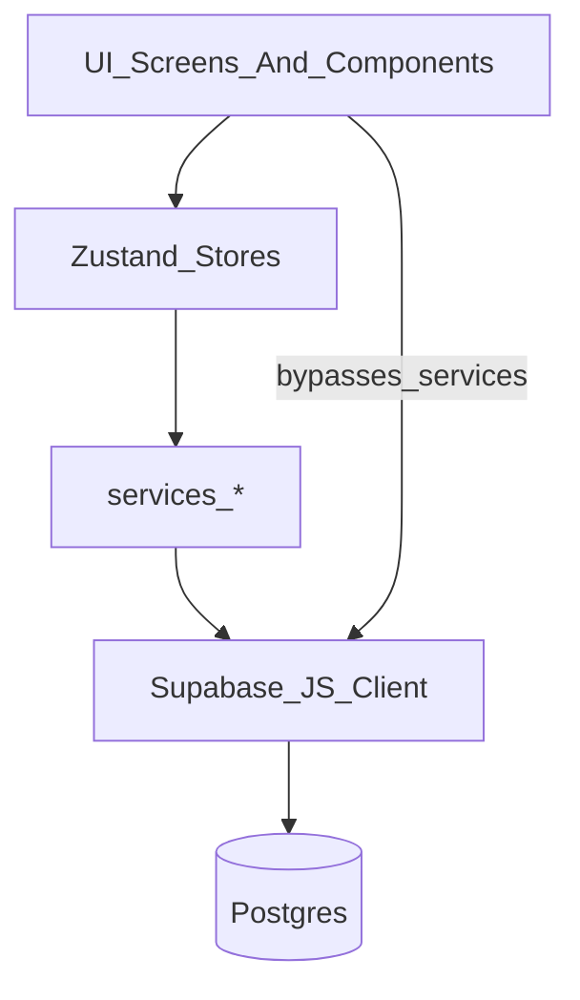

## Sessions flows

### Sessions list (personal/team)

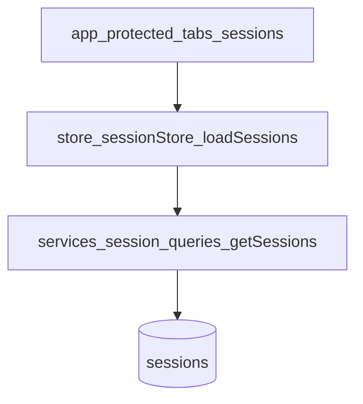

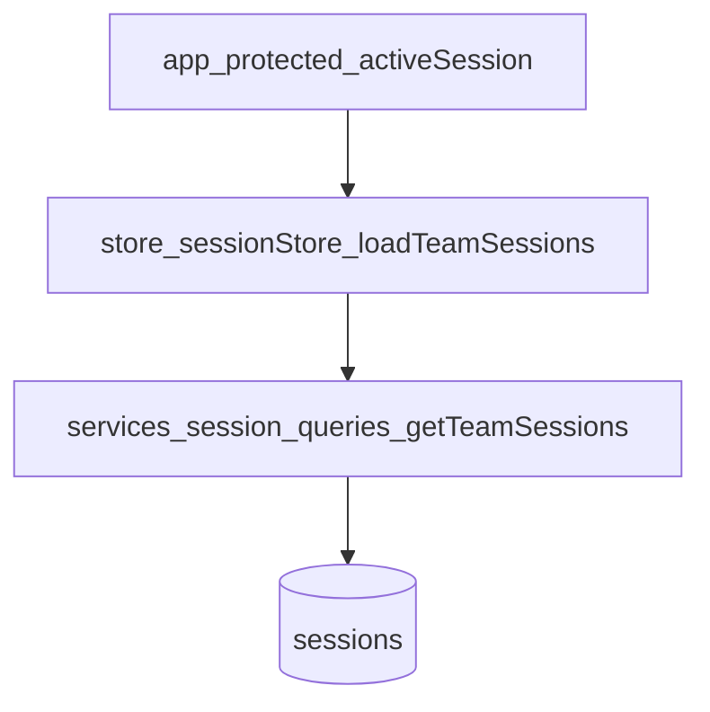

### Unified home “recent sessions + stats”

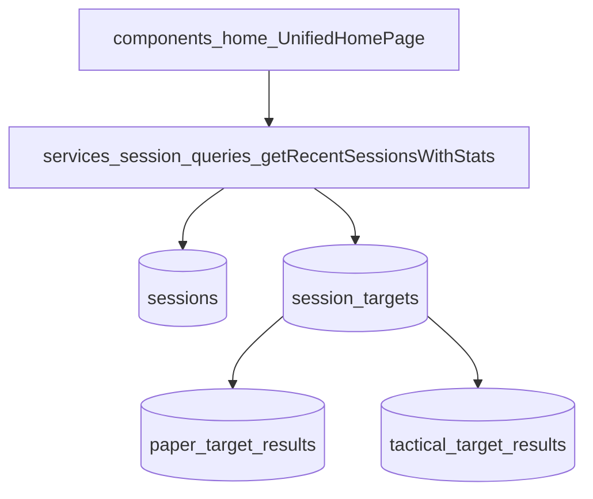

### Session detail (targets + results)

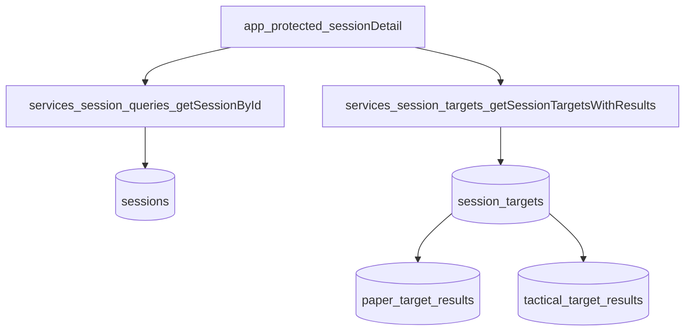

## Trainings flows

### Team trainings list

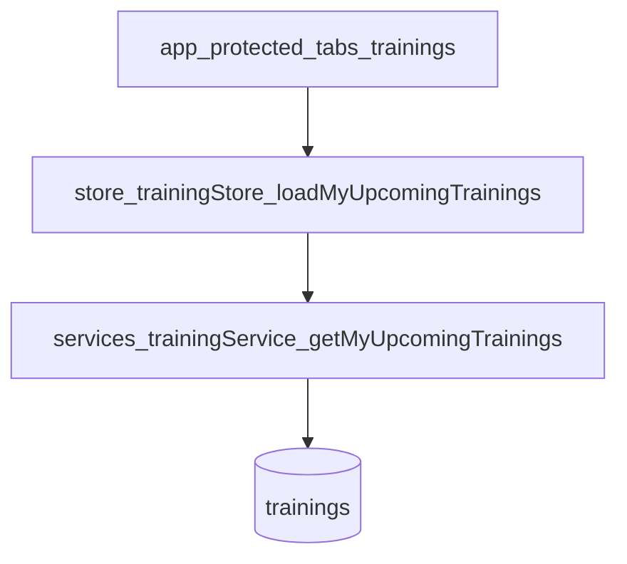

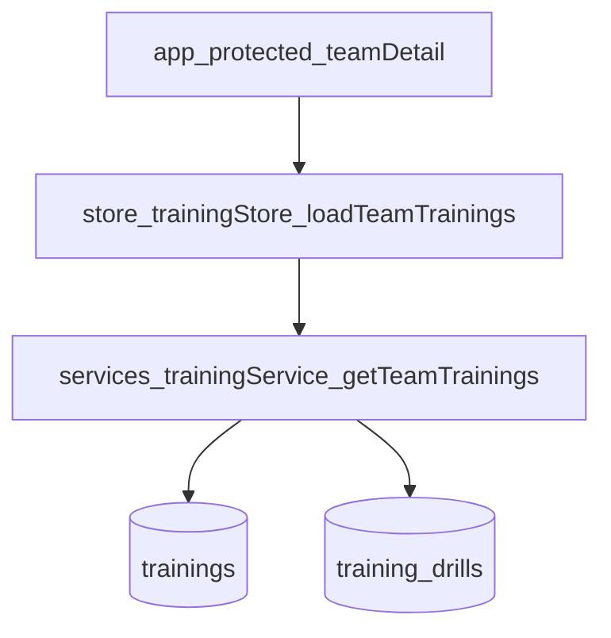

### Create training

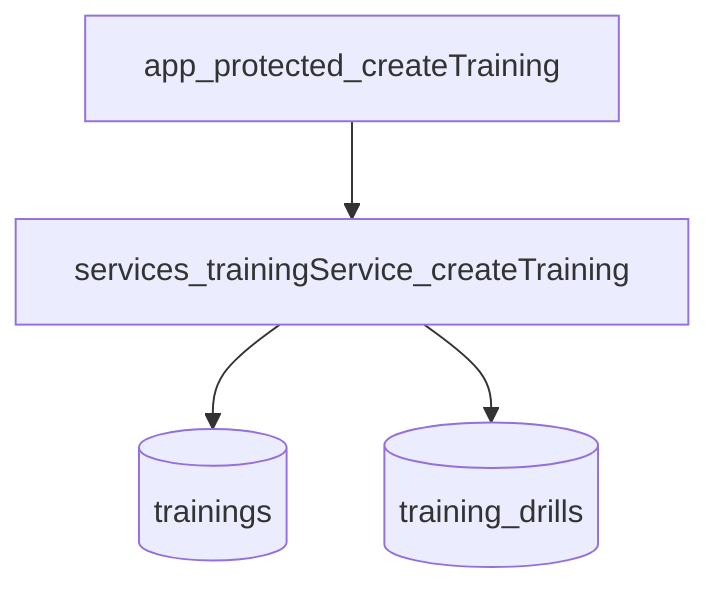

## Teams flows

### My teams (RPC)

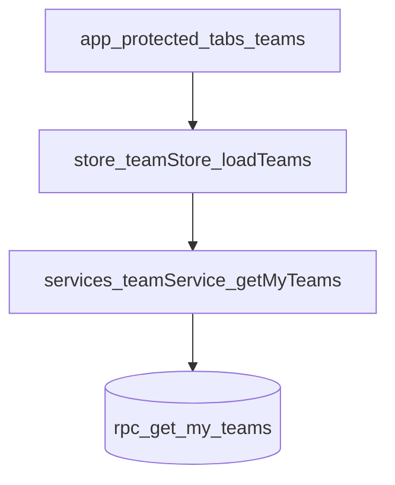

### Active team + members (RPC + fallback select)

> **Note:** As of the Unified Team Tab update, `teamWorkspace.tsx` is deprecated.
> The Team Tab (`trainings.tsx`) IS the team workspace when an activeTeam is selected.
> Team switching happens only through the pill/sheet - no separate "team page" navigation.

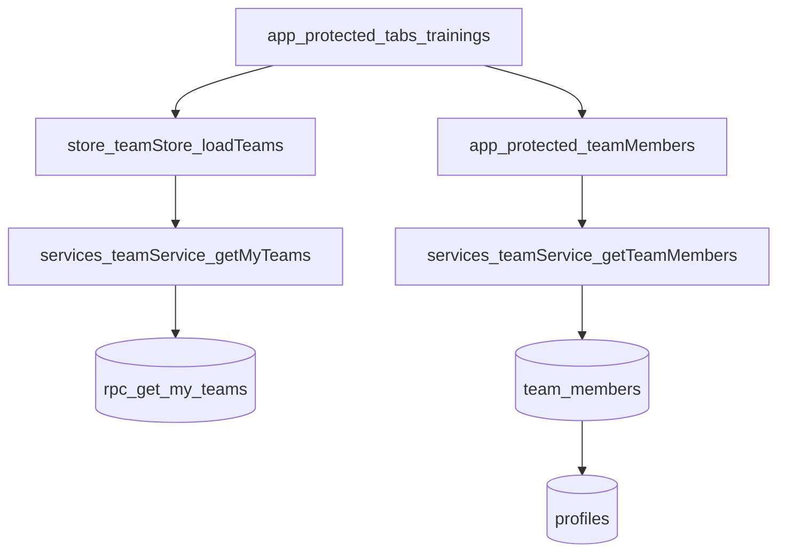

### Legacy: Team Workspace (deprecated)

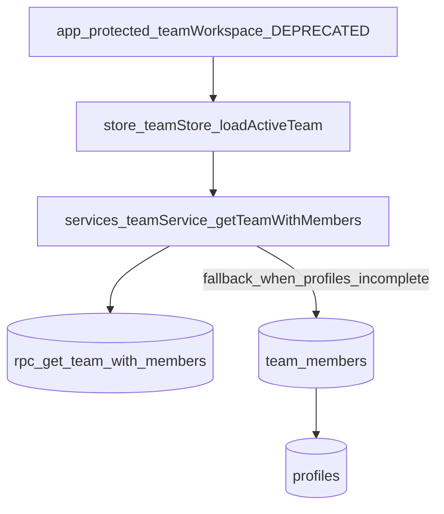

## Invitations flows

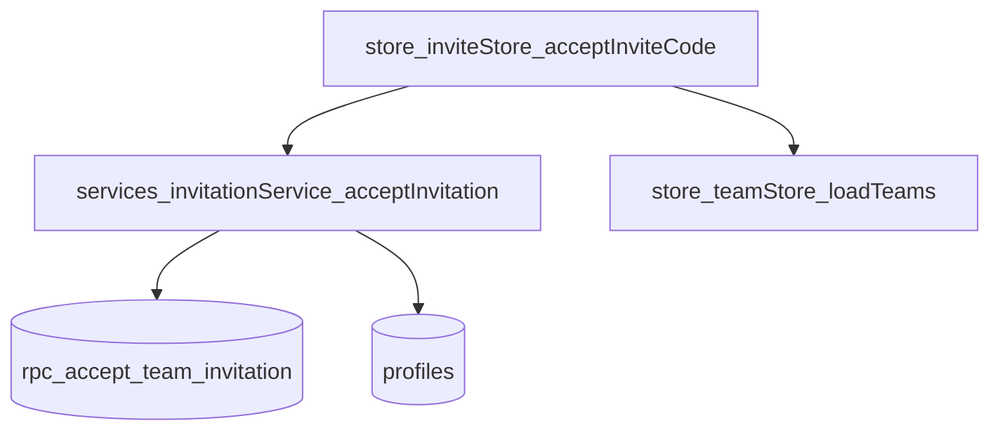

## Current bypass paths (should be routed through services)

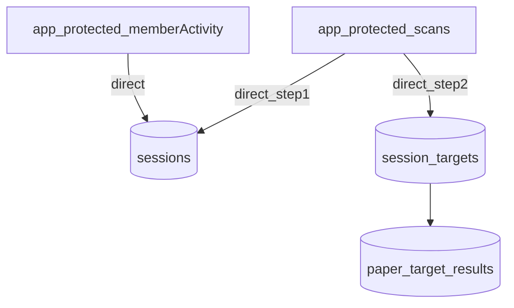

