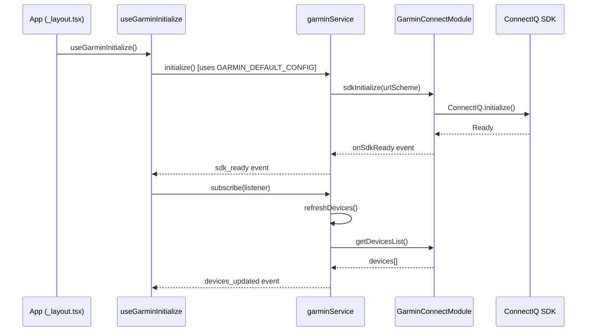
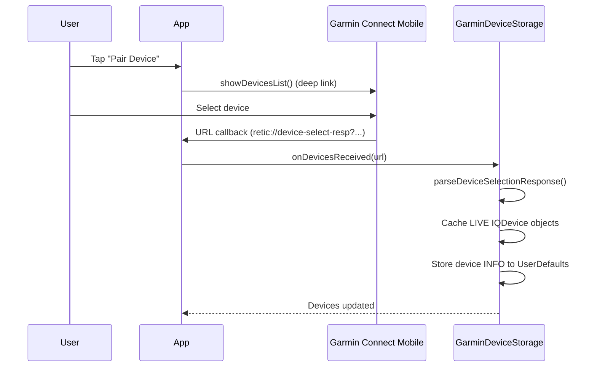
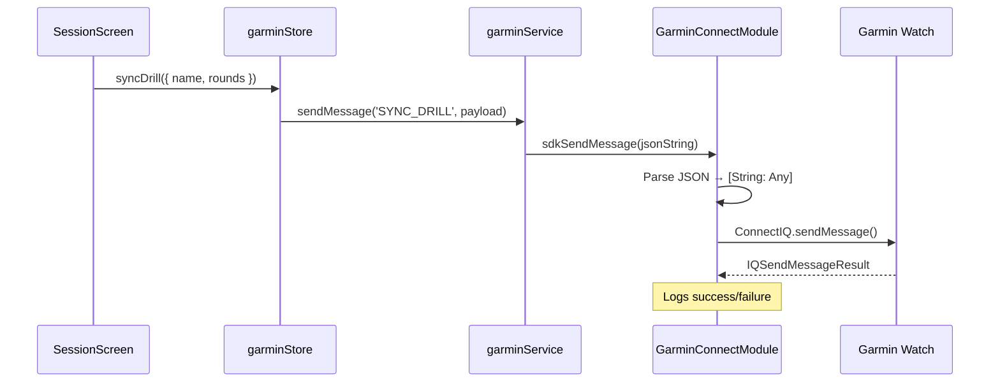

# Garmin Connect IQ Integration

> **Status**: Production-ready (patch-based)  
> **Last Updated**: December 2024

## Table of Contents

1. [Overview](#overview)
2. [Architecture](#architecture)
3. [File Structure](#file-structure)
4. [Data Flow](#data-flow)
5. [Native Layer (Swift)](#native-layer-swift)
6. [Build Process](#build-process)
7. [Critical Caveats](#critical-caveats)
8. [Troubleshooting](#troubleshooting)
9. [Configuration](#configuration)
10. [Future Considerations](#future-considerations)

---

## Overview

This integration enables communication between the React Native app and Garmin wearables via the **ConnectIQ Mobile SDK**. It uses the `react-native-garmin-connect` npm package with **custom patches** to fix session-based device handling, improve error reporting, and add debug logging.

### Key Features

- Device pairing via Garmin Connect Mobile (GCM)
- Bi-directional messaging with the watch app
- Session tracking (shots, timestamps, heart rate)
- Status change notifications
- Automatic device reconnection

---

## Architecture

```
┌─────────────────────────────────────────────────────────────────────────┐
│                              React Native                               │
├─────────────────────────────────────────────────────────────────────────┤
│                                                                         │
│  ┌─────────────────────┐    subscribes    ┌───────────────────────────┐ │
│  │   useGarminSession  │ ◄─────────────── │      garminStore.tsx      │ │
│  │       (hook)        │                  │      (Zustand state)      │ │
│  └─────────────────────┘                  └───────────────────────────┘ │
│           │                                          ▲                  │
│           │ uses                                     │ subscribes       │
│           ▼                                          │                  │
│  ┌───────────────────────────────────────────────────┴────────────────┐ │
│  │                        garminService.ts                            │ │
│  │                  (Native bridge, event emitters)                   │ │
│  └────────────────────────────────────────────────────────────────────┘ │
│                                   │                                     │
│                                   │ Native calls & events               │
│                                   ▼                                     │
├─────────────────────────────────────────────────────────────────────────┤
│                          react-native-garmin-connect                    │
│                               (+ patches)                               │
├─────────────────────────────────────────────────────────────────────────┤
│                                                                         │
│  ┌───────────────────────┐  ┌───────────────────┐  ┌─────────────────┐  │
│  │ GarminConnectModule   │  │ GarminDeviceStorage│  │  AppConstants  │  │
│  │      .swift           │  │      .swift       │  │     .swift     │  │
│  │ (SDK delegate, events)│  │ (Session devices) │  │  (Config vars) │  │
│  └───────────────────────┘  └───────────────────┘  └─────────────────┘  │
│                                   │                                     │
│                                   ▼                                     │
│  ┌────────────────────────────────────────────────────────────────────┐ │
│  │                    ConnectIQ.xcframework                           │ │
│  │                    (Garmin's native SDK)                           │ │
│  └────────────────────────────────────────────────────────────────────┘ │
│                                                                         │
└─────────────────────────────────────────────────────────────────────────┘
                                   │
                                   │ Bluetooth / URL Scheme
                                   ▼
                    ┌──────────────────────────────┐
                    │   Garmin Connect Mobile App  │
                    │           (GCM)              │
                    └──────────────────────────────┘
                                   │
                                   │ Bluetooth LE
                                   ▼
                    ┌──────────────────────────────┐
                    │     Garmin Watch + App       │
                    │  (ConnectIQ watch app)       │
                    └──────────────────────────────┘
```

---

## File Structure

### React Native Layer

| File | Responsibility |
|------|----------------|
| `services/garminService.ts` | Native bridge wrapper. Initializes SDK, manages event subscriptions, sends messages to watch. **Singleton module** - direct communication with Swift. |
| `store/garminStore.tsx` | Zustand store for reactive state. Subscribes to `garminService` events and exposes hooks for UI components. |
| `hooks/useGarminSession.ts` | High-level hook for session screens. Syncs drill config, receives session data, handles lifecycle. |

### Build Configuration

| File | Responsibility |
|------|----------------|
| `plugins/withGarminUrlHandler.js` | **Expo config plugin**. Modifies native iOS project during `expo prebuild`: adds URL scheme handling, `-ObjC` linker flag, and critical `HEADER_SEARCH_PATHS` fix for `ConnectIQ.h`. |
| `patches/react-native-garmin-connect+0.3.0.patch` | **patch-package patches**. Contains Swift code modifications applied to `node_modules` on `npm install`. |
| `app.json` → `plugins` | Registers `withGarminUrlHandler` for prebuild. |

### Native Swift Layer (via patch)

| File | Responsibility |
|------|----------------|
| `ios/AppConstants.swift` | Configuration constants including `APP_ID` (watch app UUID). Made mutable via patch. |
| `ios/GarminDeviceStorage.swift` | **Critical**: Manages session-based `IQDevice` cache. Devices from GCM are only valid within the current app session. |
| `ios/GarminConnectModule.swift` | Main SDK delegate. Handles device connection, status changes, message serialization, and React Native event emission. |
| `ios/GarminConnect.h/.m` | Objective-C bridge to expose Swift module to React Native. |
| `ios/ConnectIQ.xcframework` | Garmin's proprietary SDK binary (vendored). |

---

## Data Flow

### Initialization Flow



### Device Pairing Flow



### Message Flow (App → Watch)



---

## Native Layer (Swift)

### Session-Based Device Handling

**This is the most critical concept to understand.**

Garmin's `IQDevice` objects are **session-based**. They cannot be serialized/persisted. When the app restarts:

1. Previously paired devices appear in `UserDefaults` (display info only)
2. But the `IQDevice` references are **invalid**
3. User must re-pair via Garmin Connect Mobile to get fresh `IQDevice` objects

The patch implements this via:

```swift
// GarminDeviceStorage.swift

// Session-only cache (cleared on app restart)
private static var sessionDevices: [String: IQDevice] = [:]

// Called when GCM returns device selection
public static func onDevicesReceived(open url: URL) {
    // Parse FRESH IQDevice objects from URL
    let devices = ConnectIQ.sharedInstance()?.parseDeviceSelectionResponse(from: url)
    
    // Cache live objects for THIS session only
    for device in devices {
        sessionDevices[device.uuid.uuidString] = device
    }
}

// Connection requests MUST use session cache
public static func getDevice(byId id: String) -> IQDevice? {
    return sessionDevices[id]  // Returns nil if not in current session
}
```

### Status Reasons

The patch enhances status reporting with reasons:

| Status | Reason | Action |
|--------|--------|--------|
| `CONNECTED` | "connected" | Ready to send/receive |
| `ONLINE` | "notConnected - watch reachable but app not open" | Open watch app |
| `OFFLINE` | "bluetoothNotReady - turn on Bluetooth" | Enable Bluetooth |
| `OFFLINE` | "invalidDevice - re-pair required" | Re-pair via GCM |
| `OFFLINE` | "notFound - open Garmin Connect Mobile" | Open GCM app |

### needsRepairing Flag

When a device from `UserDefaults` has no live session reference:

```swift
let hasLiveSession = sessionDevices[device.id] != nil
deviceObject["needsRepairing"] = !hasLiveSession
```

The UI should prompt the user to re-pair when `needsRepairing` is true.

---

## Build Process

### Prerequisites

1. Garmin Connect Mobile installed on test device
2. A registered ConnectIQ watch app (get UUID from developer.garmin.com)
3. Xcode with valid signing

### Build Steps

```bash
# 1. Install dependencies (applies patches automatically)
npm install

# 2. Prebuild native projects (runs config plugin)
npx expo prebuild --clean

# 3. Install pods (with header path fix from plugin)
cd ios && pod install && cd ..

# 4. Build and run
npx expo run:ios

# OR for production build
eas build --platform ios --profile preview
```

### What Happens During Prebuild

1. **withGarminUrlHandler.js** runs:
   - Adds `-ObjC` linker flag to Xcode project
   - Injects `HEADER_SEARCH_PATHS` fix into Podfile
   - Adds `gcm-ciq` to `LSApplicationQueriesSchemes`
   - Adds Bluetooth usage description
   - Injects URL handler into `AppDelegate.swift`

2. **patch-package** applies:
   - Swift code modifications from `patches/react-native-garmin-connect+0.3.0.patch`

---

## Critical Caveats

### ⚠️ Do NOT Remove the Patch

The patch file contains critical fixes:
- Session-based device handling (prevents crashes)
- Proper `ConnectIQ.h` import paths
- Thread-safe event emission
- Enhanced error handling

Without it, devices will fail to connect after app restart.

### ⚠️ Do NOT Delete ios/ Directory Casually

```bash
# DANGEROUS - will require full rebuild
rm -rf ios/

# If you must, ensure full rebuild:
npm install                    # Re-applies patches
npx expo prebuild --clean      # Re-runs config plugin
cd ios && pod install && cd ..
```

### ⚠️ IQDevice Objects Cannot Be Persisted

Never try to serialize `IQDevice` to JSON/UserDefaults. Only store device info (UUID, name, model).

### ⚠️ Main Thread for React Native Events

All `emitter.sendEvent()` calls must be on main thread:

```swift
DispatchQueue.main.async {
    self.emitter.sendEvent(withName: "onMessage", body: eventMessage)
}
```

---

## Troubleshooting

### "ConnectIQ.h file not found"

**Cause**: Header search paths not configured

**Fix**:
1. Ensure `withGarminUrlHandler.js` is in `app.json` plugins
2. Run `npx expo prebuild --clean`
3. Verify Podfile contains the header path fix
4. Run `pod install`

### Device Shows "OFFLINE" After App Restart

**Cause**: IQDevice session expired (expected behavior)

**Fix**: User must re-pair via Garmin Connect Mobile. Check `needsRepairing` flag and show UI prompt.

### Messages Not Sending

**Cause**: `connectedApp` is nil

**Checklist**:
1. Is status `CONNECTED` (not just `ONLINE`)?
2. Is the watch app open?
3. Check Xcode console for `[Garmin]` logs

### "Watch app not connected"

**Cause**: Device status is `ONLINE` but watch app isn't running

**Fix**: User must open the ConnectIQ app on their watch.

### Build Fails After npm install

**Cause**: Patches didn't apply

**Check**:
```bash
cat node_modules/react-native-garmin-connect/ios/GarminDeviceStorage.swift
# Should contain "sessionDevices" - if not, patches failed
```

**Fix**:
```bash
rm -rf node_modules
npm install
```

---

## Configuration

### URL Scheme

Set in `app.json`:
```json
{
  "expo": {
    "scheme": "retic"
  }
}
```

Referenced in:
- `plugins/withGarminUrlHandler.js` (Info.plist, AppDelegate)
- `services/garminService.ts` (initialize call)
- `store/garminStore.tsx` (useGarminInitialize)

### Watch App ID & URL Scheme

**Centralized in one place** - `services/garminService.ts`:

```typescript
// garminService.ts
export const GARMIN_DEFAULT_CONFIG: GarminConfig = {
  urlScheme: 'retic',
  appId: '467f4bb7-cd3c-45c4-a39b-9bb78260c9ed',
} as const;
```

**To change**: Update only `GARMIN_DEFAULT_CONFIG` - all other code uses this.

**Optional override** (for testing/multi-app):
```typescript
initialize({ appId: 'custom-uuid' }); // Uses default urlScheme
initialize({ urlScheme: 'myapp', appId: 'my-uuid' }); // Full override
```

### Patch File Constants

The patch contains default values that are overwritten at runtime:
- `AppConstants.swift`: `APP_ID` - set by `initGarminSDK()`
- `GarminDeviceStorage.swift`: `urlScheme`, `appId` - set at runtime

---

## Future Considerations

### Making the Library Truly Generic

Currently, `urlScheme` and `appId` are passed to `initialize()` but there's some hardcoding. To make it fully configurable:

1. Remove hardcoded defaults from patch (use empty strings)
2. Ensure `initGarminSDK(urlScheme:appId:)` sets all values before any SDK calls
3. Consider environment variables for different build flavors

### Forking the Library

If you want to eliminate the patch file:

1. Fork `react-native-garmin-connect` to your GitHub
2. Apply patch changes directly to Swift files
3. Commit `ConnectIQ.xcframework` (use Git LFS for binary)
4. Update `package.json`: `"react-native-garmin-connect": "github:yourorg/your-fork"`
5. Test with clean build

**Warning**: The `ConnectIQ.xcframework` is ~50MB and GitHub has file size limits.

### Android Support

Currently iOS-only. Android implementation would require:

1. Kotlin/Java equivalent of Swift patches
2. Android manifest modifications for GCM deep linking
3. Similar session-based device handling

---

## UX Improvements

### Auto-Reconnect on App Resume

When the app returns to foreground, it automatically tries to reconnect to previously paired devices:

```typescript
// In useGarminInitialize() - garminStore.tsx
AppState.addEventListener('change', (nextAppState) => {
  if (wasBackground && isNowActive && status !== 'CONNECTED') {
    serviceRefreshDevices(); // Auto-attempt reconnect
  }
});
```

### GarminConnectionBanner Component

Inline banner for showing connection status with one-tap reconnect:

```tsx
import { GarminConnectionBanner } from '@/components/garmin';

// In any screen that needs watch connectivity
<GarminConnectionBanner compact />
```

Props:
| Prop | Type | Default | Description |
|------|------|---------|-------------|
| `alwaysShow` | boolean | false | Show even when connected |
| `compact` | boolean | false | Smaller, less prominent style |
| `onStatusChange` | function | - | Called when connection changes |

Features:
- Shows current status (Connected, Needs Pairing, Offline)
- One-tap reconnect (tries refresh first, then opens GCM)
- Auto-fades when connected (unless `alwaysShow`)
- Non-blocking - sessions work without watch

### Session Flow (Non-Blocking)

Watch integration is **optional** - sessions work without watch:

```typescript
// activeSession.tsx - only notifies if connected, doesn't block
if (garminStatus === 'CONNECTED') {
  sendToGarmin('SESSION_START', { ... });
}
// Session continues regardless of watch status
```

---

## Quick Reference

### Key Functions

```typescript
// Initialize (call once at app root - uses GARMIN_DEFAULT_CONFIG)
import { useGarminInitialize } from '@/store/garminStore';
useGarminInitialize();

// Or with custom config
import { initialize, GARMIN_DEFAULT_CONFIG } from '@/services/garminService';
initialize({ appId: 'custom-uuid' });

// Check connection status
import { useIsGarminConnected } from '@/store/garminStore';
const isConnected = useIsGarminConnected();

// Send message to watch
import { useGarminStore } from '@/store/garminStore';
const { syncDrill, startSession, endSession } = useGarminStore();
syncDrill({ name: 'Drill 1', rounds: 10 });

// Handle session data
import { useGarminSession } from '@/hooks/useGarminSession';
const { watchData, requestWatchData } = useGarminSession({
  sessionId: 'abc-123',
  drill: { name: 'Test', rounds: 5 },
  onSessionData: (data) => console.log(data),
});
```

### Event Types

| Event | Source | Payload |
|-------|--------|---------|
| `onSdkReady` | Native | `true` |
| `onDeviceStatusChanged` | Native | `{ name, status, reason, needsRepairing? }` |
| `onMessage` | Native | `{ type, payload }` |
| `onError` | Native | Error string |
| `onInfo` | Native | Info string |

### Console Log Prefixes

- `[Garmin] ✅` - Success
- `[Garmin] ❌` - Error
- `[Garmin] 📤` - Outgoing message
- `[Garmin] 📩` - Incoming message
- `[Garmin] 📱` - Device status change
- `[Garmin] ⚠️` - Warning

---

*Context improved by Giga AI: Used Garmin integration architecture, patch file analysis, and service/store implementation details.*

